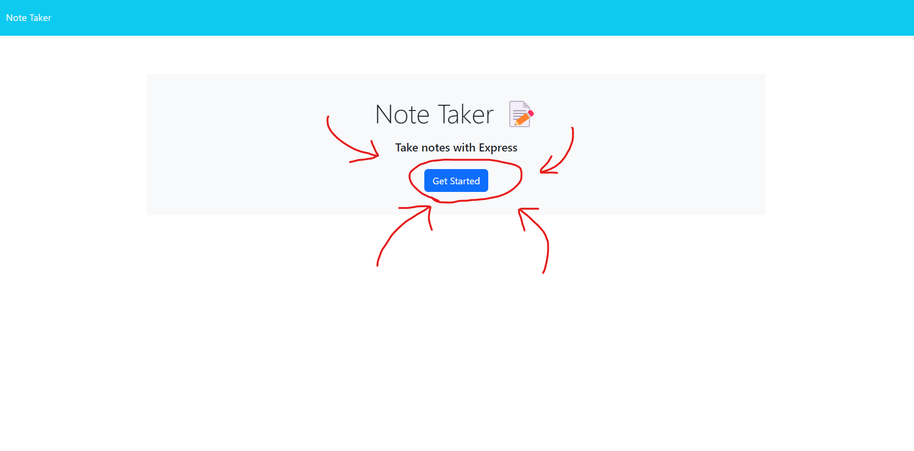
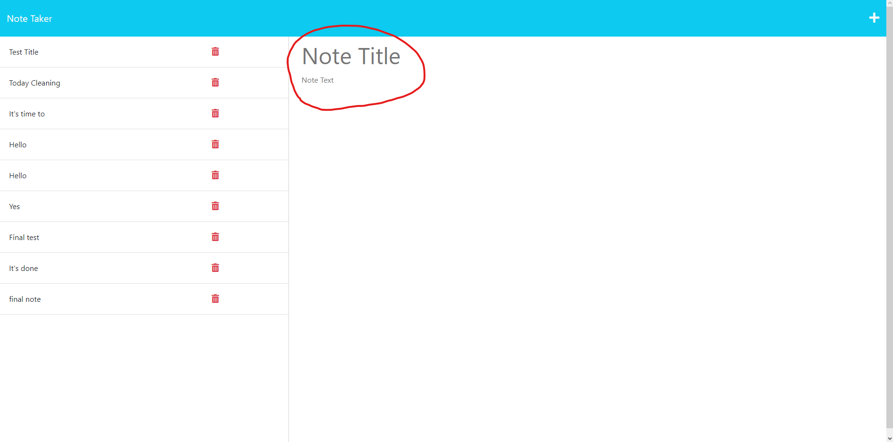

# <Note Taker>

## Description

- The motivation for this project was to make an application and deply it using heroku, to further my understanding of the backend.
- I built this project to learn about how to use heroku and databases.
- This application will let you jot down notes and save them!
- I applied and learned about databases, heroku, and some more javascript.

## Table of Contents 

- [Installation](#installation)
- [Usage](#usage)
- [Credits](#credits)
- [License](#license)

## Installation

N/A

## Usage

In order to use the application, head to the deployed website at https://gentle-lowlands-22548-f84f2c71e852.herokuapp.com 

Then you will see the landing page, click on the button that says get started to start!

Next, just input the title of your note and what you want your note to sayin the note text. After doing so, it will appear on the left hand column !

## Credits

The starter code that was used for this project was from here https://github.com/coding-boot-camp/miniature-eureka 

I always use chat gpt 3.5 for organizantion within my code https://openai.com/blog/chatgpt

## License

MIT License
